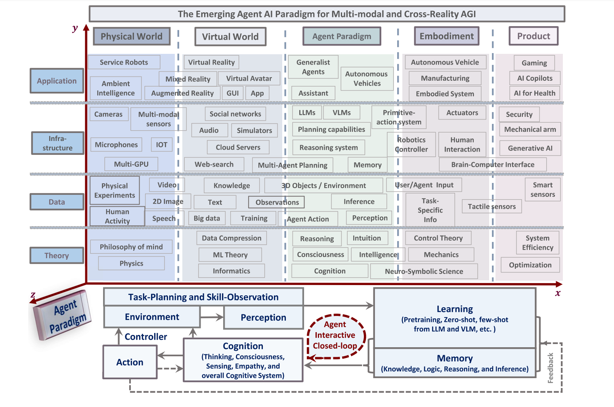

# Novedad del mercado IA/LLMs

# {background-image="images/antrophic.png" background-size="contain"}

# {background-image="images/openai.png" background-size="contain"}

# {background-image="images/markets-agents.png" background-size="contain"}

# Modo Agente
La idea de que la IA es una agente

#

::: aside
Durante *et. al.* (2024)
:::

---

::: {.r-fit-text}
Si es un agente, entonces tiene capacidad agencial
:::

---

::: {.r-fit-text}
Para hacerlo necesita de una ***mente***
:::

---

## Todo lo que hace la IA

## ¿Implica que tiene una mente?

# Tecno-optimistas
Sostienen que sí

# Punto extremo

# La Singularidad
La $AGI$

## ¿Implica que tiene una mente?

## La IA es una caja negra

No sabemos exactamente lo que sucede cada vez que pedimos algo a alguien

---

Que sea *agencial* implica trabajar sobre algo ya dado

---

::: {.r-fit-text}
Demostración
:::

---

::: {.r-fit-text}
¿Qué es lo que hace que posea una mente?
:::

---

::: {.r-fit-text}
¿Un traductor automático tiene una mente?
:::

---

::: {.r-fit-text}
¿Qué es lo que determina que tenga una mente?
:::

# Test de Turing {background-image="images/alan-turing.jpg" background-size="contain"}

::: {.notes}
  El test de Turing sostiene que una máquina puede considerarse inteligente si es capaz de generar respuestas en una conversación escrita que sean indistinguibles de las que daría un ser humano. Fue propuesto por Alan Turing en 1950 como un criterio para determinar si una máquina "piensa". En la prueba, un evaluador humano conversa por escrito con un humano y una máquina sin saber cuál es cuál; si después de un tiempo no puede distinguir con certeza quién es la máquina, esta habría pasado el test, demostrando un comportamiento inteligente similar al del ser humano. La prueba no mide necesariamente si las respuestas son correctas, sino si parecen humanas.
:::

---

::: {.r-fit-text}
Quedó obsoleto
:::

---

::: {.r-fit-text}
¿Que otros criterios podemos tener para determinar si la IA tiene o no mente?
:::

---

::: {.r-fit-text}
Comportamiento ❌
:::

---

::: {.r-fit-text}
¿Conocimiento de lo que sucede dentro de la caja negra?
:::

---

::: {.r-fit-text}
¿Explicite que sabe interpretar?
:::

---

::: {.r-fit-text}
¿Resultados?
:::

---

::: {.r-fit-text}
¿Autonomía?
:::

# {background-image="images/skynet.png"}

---

::: {.r-fit-text}
Posibles respuestas
:::

---

::: {.r-fit-text}
Semiótica
:::

---

::: {.r-fit-text}
Lógicas formales
:::

---

::: {.r-fit-text}
👁️ Ojo crítico a las palabras 👁️
:::

---

::: {.r-fit-text}
¡Muchas gracias!
:::

✉️ `ivan.gavriloff@derecho.unt.edu.ar`